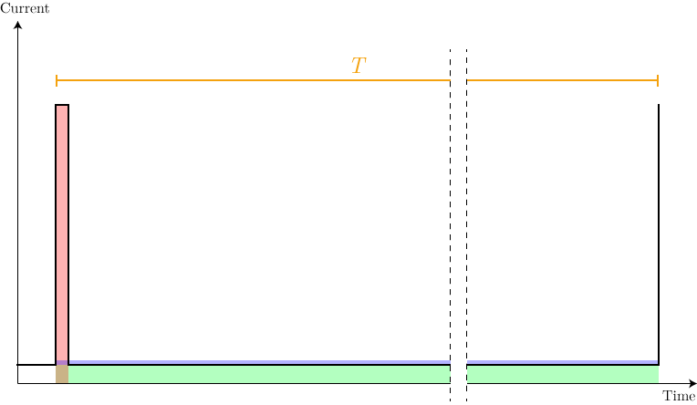

# BLINK-ERRR  
*For how long a nice lady will be able to blink her eye on a CR2032 cell?*  
**We'll see!**

<!-- TOC depthFrom:2 depthTo:6 withLinks:1 updateOnSave:1 orderedList:0 -->

- [Purpose of the project](#purpose-of-the-project)
- [Artwork](#artwork)
- [Hardware](#hardware)
- [Firmware](#firmware)
	- [Toolchain and environment setup](#toolchain-and-environment-setup)
	- [Programmers](#programmers)
	- [Uploading with jtag2updi and avrdude (AVRDUDESS)](#uploading-with-jtag2updi-and-avrdude-avrdudess)
	- [Firmware working and internals](#firmware-working-and-internals)
		- [v1.0](#v10)
		- [v1.1](#v11)
- [Battery life expectancy](#battery-life-expectancy)

<!-- /TOC -->

## Purpose of the project
_This project may or may not have any sense in the traditional sense of having a sense._ The project is the product of some sperimentation that lay between a **purely technical challenge** and **an artistic dimension**.

I got intrested in low power microcontroller stuff, and I wanted to do a simple little project to see for how long I could blink an led on a small battery, optimizing as much as I could. The specs i challenged myself to comply with were pretty easy:

- Blink an LED every 3-10 seconds;
- The blink should be at least visible outside without direct sunlight;
- The blink should be produced by a microcontroller;
- It should run as long as possible on a single CR2032 (obviously without removing power to the microcontroller);
- It should be the size and shape of a coin or little more.

In this form it remained for a long time just an idea in my drawer, until I found a nice way to express it to a non-technical audience. That was the point where i conceived BLINK-ERRR as we know it.  

## Artwork
While the concept for this project is mine, the artwork on the front of the board is a kind gift, courtesy of Francesca Ravasio. Kudos to her!

## Hardware
The hardware is based around an **ATtiny202**, one of the newest *(2018)* microcontroller in the ATtiny family. This microcontroller offers great low power performances, with the ability to run on the 32kHz oscillator and a **0.1uA** power down mode.  

 The original plan was to light the led with a square wave generated by the microcontroller, filtered through an LC lowpass passive filter, to not waste any power across a liming resistor. In the end, the square wave solution did not bring any advantage, so **the filter was removed and L1 was replaced with a resistor**.  

 R1 is the placeholder for a shunt, replaced with a 0 ohm jumper link in the final version.

## Firmware

### Toolchain and environment setup
I'm using MPLAB X with the AVR GCC toolchain installed.  
Installing the toolchain might be trivial if you have experience with MPLAB X, if not just follow these steps (for Windows):
- Download the avr GCC toolchain from Microchip [here](https://www.microchip.com/mplab/avr-support/avr-and-arm-toolchains-c-compilers).
- Extract the toolchain to a know path in your system. I've used `C:\Program Files (x86)\Microchip\avr-gcc`
- Open MPLAB X and go to Tools -> Options -> Embedded -> Build Tools -> Add...
- Select **the bin folder** in your avr-gcc folder.  

Now your toolchain should be set up.

### Programmers
The ATtiny202 uses the new UPDI inteface, for which i didn't have any programmer. There are a lot of options:
- **[jtag2updi](https://github.com/ElTangas/jtag2updi) (DIY / Arduino based)**: this is the DIY solution, you can upload this code to an Arduino Uno and use it as a programmer. This is the approach i've used. I'm not sure if this interface can be used for hardware debugging.
- **[MPLAB Snap](https://www.microchip.com/developmenttools/ProductDetails/PartNO/PG164100) (Cheapest official programmer)**: This is a new line of very cheap programmers by Microchip. It is very cheap but, beeing new, it has not a lot of support yet. There's little or no support for debugging.
- **[Atmel-ICE](https://www.microchip.com/DevelopmentTools/ProductDetails/ATATMEL-ICE) (Programmer and debugger)**: This is the traditional AVR programmer from Atmel. It's the most expensive in this list (about 120€), but it is also an hardware debugger.
- **[PICKit4](https://www.microchip.com/developmenttools/ProductDetails/PG164140) (Most universal)**: Probably the most universal programmer of all of these. It supports both AVR and PICS. It would be probably a better choice over the Atmel ICE, but i'm not sure of the PICKit hardware debug capabilities.
### Uploading with jtag2updi and avrdude (AVRDUDESS)
As stated above, i've used the jtag2updi solution. The Author has provided a modified `avrdude.conf` file that can be passed to avrdude to add the support for the programmer and the UPDI compatible targets.  

I've uploaded it to an Arduino Uno using the Arduino IDE.
Contrary to what the author states, in my case **there was no need to cut or disable the auto-reset feature**, it works fine as is. I've connected the target to pin 6 of the Arduino and powered it with 5V from the Arduino board. The target mcu is connected to the arduino through three cables soldered directly on the pins going into the Arduino headers.  

I've used avrdude in the form of [AVRDUDESS by Zak Kemble](http://blog.zakkemble.net/avrdudess-a-gui-for-avrdude/), a GUI for avrdude. You need to install it and replace the `avrdude.conf` file in the installation folder with the one found in the jtag2updi repo.

The final command line generated by AVRDUDESS is nothing out of the ordinary, but it's reported here for reference:  
`-c jtag2updi -p t202 -P COM16 -b 115200 -U flash:w:"[replace with firmware location]":a `

### Firmware working and internals

#### v1.0
The v1.0 version of the firmware relies on the **watchdog timer** to reset the microcontroller every period.  
The firmware is **very simple and organized in functions** to stress the functional role of each code section.  
The flow can be schematized as following:
1. **First power up**
1. **Set the led as output**
1. **Initialize the system**
 	* Set the CPU clock to 1kHz
	* Enable and setup the watchdog to reset the microcontroller in 8 seconds
1. **Enter the infinite loop**
	* Blink the LED
	* Go to sleep (*power-down mode*) and wait for the watchdog reset, then restart from step 1  

This microcontroller **doesn't have the watchdog interrupt**, so the firmware had to rely on the resets.  
This has proven to be a **very inefficient method** to periodically reset the microcontroller, since the reset takes about 60 milliseconds during which the uC consumes a lot of power (for reference, the actual code execution takes about 1 ms).  
The `while(1)` loop is pointless in this application, and was kept just for future use.

#### v1.1
The v1.1 version of the firmware addresses the inefficiency of the v1.0, switching from the watchdog timer to the **Periodic Interrupt Timer** function in the **Real Time Counter** peripheral.  
The flow can be schematized as following:
1. **First power up**
1. **Set the led as output**
1. **Initialize the system**
 	* Set the CPU clock to 1kHz
	* Enable and setup the RTC to run on the 32kHz oscillator prescaled to 1kHz. Then set the PIT to happen every in 8 seconds, and enable the PIT interrupts.
1. **Enter the infinite loop**
	* Blink the LED
	* Go to sleep (*power-down mode*) and wait for the PIT wakeup
	* Clear the PIT flag and restart the loop

This is the **only other wake-up source from power down mode**, and it's likely that this was the proper method to do what i did in v1.0.  
On older AVRs it was done as in my v1.0, with the difference that the watchdog could just generate an interrupt instead of resetting the whole chip. In newer AVRs the watchdog interrupt functionality was probably deprecated by **the introduction of the RTC peripheral with its PIT capability**.

For reference, this is the current consumption for every cycle (with a 1kohm shunt), with the v1.0 waveform in blue and the v1.1 waveform in yellow:

The tall and skinny spike is the actual code exectuion and blink, and **the blue big rectangle is the extra consumption from the reset**.

*The v1.1 seems to consume a lot more in sleep, but according to my measures in DC it looks like this is not the case, and it's just a weird artifact of the waveform save function of my oscilloscope*

## Battery life expectancy
From my measures the blink phase consumes 1mA and lasts about 12ms. This phase is followed by the sleep phase consumption, lasting about 8s, with the consumption varying upon battery voltage: 2uA at highest voltage, dropping to 0.7uA at the lowest voltage. Making a conservative estimation, we can say it is always 2uA.

  

We can say that we want to transform the red area in the picture, into the blue one, to get the average consumption per period *T*, which coincides con the average consumption per unit of time, because it's constant.   
The red area is 1mA * 12ms = **12uC** (the result is in coulomb because 1A = 1C/1s). We can now obtain the height of the blue area: 12uC/8s = **1.5uA**.  
So, **the equivalent current draw is 3.5uA**.

**For a 200mA CR2032, we can expect the system to run for about 6 years, with this figure beeing a conservative estimate**. Realistically, we won't expect it to run any longer, because of component aging and the battery getting close to the end of it's shelf life.
