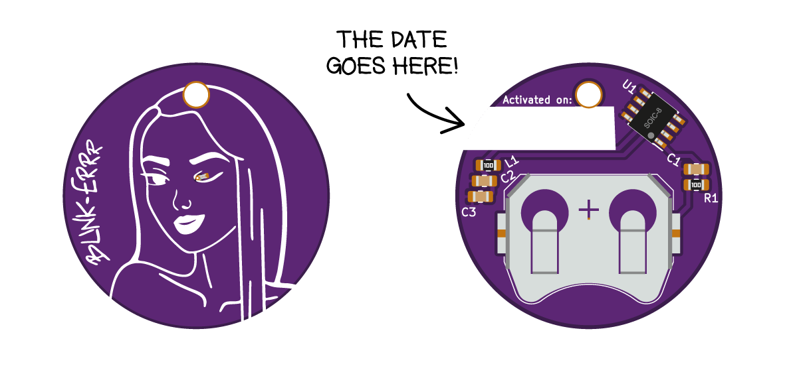

# BLINK-ERRR  
*For how long a nice lady will be able to blink her eye on a CR2032 cell?*  
**Let's see!**

## Purpose of the project
_This project may or may not have any sense in the traditional sense of having a sense._ The project is the product of some sperimentation that lay between a **purely technical challenge** and **an artistic dimension**.

I got intrested in low power microcontroller stuff, and I wanted to do a simple little project to see for how long I could blink an led on a small battery, optimizing as much as I could. The specs i challenged myself to comply with were pretty easy:

- Blink an LED every 3-10 seconds;
- The blink should be at least visible outside without direct sunlight;
- The blink should be produced by a microcontroller;
- It should run as long as possible on a single CR2032 (obviously without removing power to the microcontroller);
- It should be the size and shape of a coin or little more.

In this form it remained for a long time just an idea in my drawer, until I found a nice way to express it to a non-technical audience. That was the point where i conceived BLINK-ERRR as we know it.  

## Artwork
While the concept for this project is mine, the artwork on the front of the board is a kind gift, courtesy of Francesca Ravasio. Kudos to her!

## Hardware
The hardware is based around an **ATtiny202**, one of the newest microcontroller in the ATtiny family. This microcontroller offers great low power performances, with the ability to run on the 32kHz oscillator and a **0.1uA** power down mode.  

 The original plan was to light the led with a square wave generated by the microcontroller, filtered through an LC lowpass passive filter, to not waste any power across a liming resistor. In the end, the square wave solution did not bring any advantage, so **the filter was removed and L1 was replaced with a resistor**.  

## Firmware
I'm using MPLAB X with the AVR GCC toolchain.

### chiedete a vb che io non lo so
